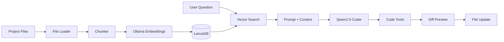

# LocalCode

A local coding assistant powered by **Ollama** and **RAG** (Retrieval-Augmented Generation). Index any codebase, ask questions about it, and let an agent read files, search symbols, and propose edits — all running on your machine.

No cloud API. No code leaving your laptop.

## Features

- **Local LLM** — Qwen2.5-Coder via Ollama
- **RAG pipeline** — scan → chunk → embed → store in LanceDB
- **Multi-project indexes** — each repo gets its own vector store; switch without re-indexing
- **Incremental sync** — only re-embeds changed files
- **Agent mode** — multi-step tool loop (read, grep, edit, git, AST references)
- **Simple RAG mode** — single-shot Q&A without the agent loop
- **Browser diff preview** — Claude-style review UI before applying writes/edits
- **Slash commands** — `/grep`, `/read`, `/edit`, `/projects`, and more
- **Conversation memory** — follow-up questions in chat

## Architecture

```
Project Files → File Loader → Chunker → Ollama Embeddings → LanceDB
                                                              ↓
User Question → Vector Search → Relevant Chunks → Prompt + Context
                                                              ↓
                              Local LLM → Tools → Diff Review → Apply
```



## Prerequisites

- [Node.js](https://nodejs.org/) 18+
- [Ollama](https://ollama.com/) running locally

Pull the required models:

```bash
ollama pull qwen2.5-coder:14b
ollama pull nomic-embed-text
```

## Installation

### From source

```bash
git clone https://github.com/siddharth17vaishnav/ai-assistant.git
cd ai-assistant
npm install
npm run build
```

### As a global CLI

```bash
npm install -g localcode
# or from this repo:
npm link
```

Then use the `localcode` command anywhere:

```bash
localcode index ./my-app
localcode chat ./my-app
localcode query ./my-app "How does routing work?"
localcode --help
```

### Build the package

```bash
npm run build          # compile to dist/
npm pack               # create localcode-1.0.0.tgz
```

Create a `.env` file:

```env
PROJECT_PATH=D:\path\to\your\project
OLLAMA_BASE_URL=http://localhost:11434
LLM_MODEL=qwen2.5-coder:14b
EMBED_MODEL=nomic-embed-text
```

`PROJECT_PATH` is optional if you always pass the project via CLI.

## Quick Start

```bash
# 1. Index a project
npm run index -- D:\path\to\your\project

# 2. Chat with the agent
npm run chat -- D:\path\to\your\project

# 3. One-shot question (no agent loop)
npm run query -- D:\path\to\your\project "How does routing work?"
```

## Project Path

Pass the target codebase as a CLI argument (overrides `PROJECT_PATH` in `.env`):

```bash
npm run chat -- D:\Projects\MyApp
npm run chat -- --project ../my-app
npm run index -- -p ./portfolio
```

With npm, use `--` before arguments:

```bash
npm run index -- --project ./my-app
```

## Scripts

Development (TypeScript directly via tsx):

| Command | Description |
|---------|-------------|
| `npm run build` | Compile TypeScript to `dist/` |
| `npm run index` | Incremental index sync |
| `npm run index:full` | Full rebuild of the index |
| `npm run chat` | Interactive agent chat (default) |
| `npm run chat:simple` | Single-shot RAG mode |
| `npm run chat:watch` | Chat + auto re-index on file changes |
| `npm run query` | One-shot question from the terminal |
| `npm run watch` | Watch files and re-index on changes |
| `npm run dev` | List loaded project files (smoke test) |

Production (compiled CLI):

```bash
localcode chat ./my-app
localcode index ./my-app --full
```

### Flags

| Flag | Description |
|------|-------------|
| `--project <path>` / `-p` | Target codebase path |
| `--simple` | RAG mode instead of agent |
| `--watch` | Auto-sync index on file changes |
| `--no-ui` | Terminal-only diff preview (skip browser) |
| `--full` | Force full index rebuild |

## Chat Commands

Inside `npm run chat`:

| Command | Description |
|---------|-------------|
| `/help` | Show available commands |
| `/clear` | Clear conversation memory |
| `/read <path>` | Read a file with line numbers |
| `/write <path>` | Write a file (multiline, end with `---`) |
| `/edit <path> <start> <end>` | Replace a line range |
| `/grep <pattern>` | Regex search across the codebase |
| `/find <symbol>` | Find definitions (function, class, type) |
| `/refs <symbol>` | Find all references via AST |
| `/imports <path>` | List imports in a file |
| `/importers <path>` | Find files that import a module |
| `/git` | Git status and diff summary |
| `/projects` | List all indexed projects |
| `/reindex` | Run incremental index sync |
| `exit` / `quit` | Exit chat |

## Agent Tools

In agent mode, the LLM can call these tools automatically:

| Tool | Description |
|------|-------------|
| `search_codebase` | Semantic search over the index |
| `read_file` | Read a project file |
| `grep` | Regex search |
| `find_symbol` | Find symbol definitions |
| `find_references` | AST reference search |
| `list_imports` | Imports in a file |
| `find_importers` | Files importing a module |
| `git_status` | Git status and recent diff |
| `edit_file` | Replace a line range |
| `write_file` | Write or overwrite a file |

Mutating tools (`edit_file`, `write_file`) open a **browser diff preview** for approval before applying.

Preview server runs at `http://127.0.0.1:3847`. Use `--no-ui` to fall back to terminal `y/N`.

## Index Storage

Each project gets its own isolated index:

```
storage/
  projects.json
  projects/
    <hash>/
      manifest.json    # file mtimes for incremental sync
      lancedb/         # vector embeddings
```

Switch between indexed projects instantly — no full rebuild unless files changed.

```
npm run index -- D:\Projects\App-A
npm run index -- D:\Projects\App-B
npm run chat -- D:\Projects\App-A   # uses App-A index
npm run chat -- D:\Projects\App-B   # uses App-B index
```

## Project Structure

```
src/
├── cli/           # Entry points (chat, index, query, watch)
├── core/          # Config, types, CLI args, project storage
├── indexing/      # Loader, chunker, embedder, LanceDB, sync
├── retrieval/     # Vector search + context assembly
├── llm/           # Ollama client and prompt builder
├── agent/         # Agent loop, tool parsing, session memory
├── tools/         # Read, write, grep, git, AST tools
└── preview/       # Browser diff review UI
```

## Tech Stack

| Layer | Technology |
|-------|------------|
| Runtime | TypeScript, Node.js |
| LLM | Ollama (Qwen2.5-Coder) |
| Embeddings | Ollama (nomic-embed-text) |
| Vector DB | LanceDB |
| AST analysis | ts-morph |
| File scanning | fast-glob |

## License

ISC
